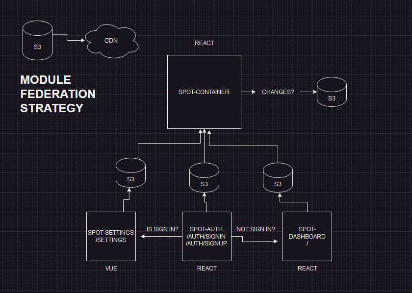

# SPOT MICROFRONTENDS - DOCUMENTACION



## Como trabajan los microfrontends?
Los microfrontends son una forma de desarrollar aplicaciones web dividiéndolas en partes más pequeñas e independientes, cada una siendo una parte de la interfaz de usuario. Esto permite que diferentes equipos de desarrollo trabajen en secciones específicas de la aplicación de manera separada, lo que facilita la escalabilidad, el mantenimiento y la implementación de cambios.

## Con que microfrontends nos encontramos en este repositorio?
Nos encontraremos con 4 packages:
- spot-container
- spot-dashboard
- spot-auth
- spot-settings
Cada uno de ellos con su particularidad, spot-container es el proyecto CONTENEDOR de los demas microfrontends los cuales estan conectados con su aplicacion contenedora usando webpack y la estrategia de module federation

## Que es Module Federation?
Module Federation es una característica de Webpack, una herramienta de empaquetado de módulos en JavaScript. Permite compartir módulos (o piezas de código) entre diferentes aplicaciones web independientes en tiempo de ejecución, lo que significa que diferentes microfrontends pueden intercambiar funcionalidades entre ellos de manera dinámica.

## Con que tecnologias estan desarrollado cada package?
- spot-container: React
- spot-dashboard: React
- spot-auth: React
- spot-settings: Vue

## Podriamos utilizar otras tecnologias si asi lo quisieramos en un futuro por una necesidad del equipo de ingenieria?
Si, por supuesto, usando Module Federation podemos utilizar cualquier framework de trabajo que necesitemos a futuro, por eso es una solucion altamente escalable, no tan solo podremos optar por soluciones de moda, sino tambien pensando en mayor performance y convenienza, reduciendo asi tiempos de desarrollo y adaptandose al conocimiento del equipo de ingenieria

## Con que tecnologias en total trabajamos en este proyecto?
Utilizamos webpack, react, vue, react-router-dom, material-ui, css vanilla, github actions y workflows, aws s3 para subir archivos estaticos y servirlos mediante cdn usando aws cloudfront

## Potenciales desafio usando esta arquitectura
Demasiada configuracion previa para iniciar el proyecto, primero debemos encarar una solucion con webpack de forma local para levantar el primer microfrontend de forma aislada, luego crear una configuracion de webpack para produccion usando el plugin de module federation que nos ofrece webpack, e ir conectando los MF con su contenedor, una vez que realizamos esta ardua tarea, ya es sencillo seguir avanzando en crear mas y mas MFS a demanda y necesidad

## Como se deploya a produccion?
Cada proyecto tiene su yml con una serie de steps que se ejecutaran en los actions de github cada vez que ocurra un cambio dentro del respectivo proyecto.
En cada yml se establece por default un directorio de trabajo (directorio root de cada proyecto), se asigna una maquina virtual donde correra cada step y se ejecutan los comandos necesarios para realizar el build de produccion, subirlos a un bucket de s3 previamente configurado en una cuenta, y luego servir esos archivos estaticos usando aws cloudfront.

## Que tiene que pasar para que este pipeline o action se ejecute?
Cada vez que ocurra cambios en la rama master, se ejecutara un pipeline especifico segun que cambios se hicieron en determinado proyecto.
Ejemplo: 
    Se hicieron cambios dentro de spot-dashboard entonces se ejecutara spot-dashboard.yml

## Como levantar el proyecto localmente

Clonar el proyecto

```bash
  git clone git@github.com:fmruiz/mf-spot.git
```

Ir al directorio del proyecto

```bash
  cd mf-spot
```

Aqui tenemos una carpeta llamada 'packages' y dentro tenemos cada microfrontend, debemos entrar a cada MF e instalar sus dependencias

```bash
  cd packages/spot-container
  npm install
```
```bash
  cd packages/spot-dashboard
  npm install
```
```bash
  cd packages/spot-auth
  npm install
```
```bash
  cd packages/spot-settings
  npm install
```

Dentro de cada microfrontend podriamos ejecutar el siguiente comando para levantar de forma aislada cada proyecto

```bash
  npm run start
```